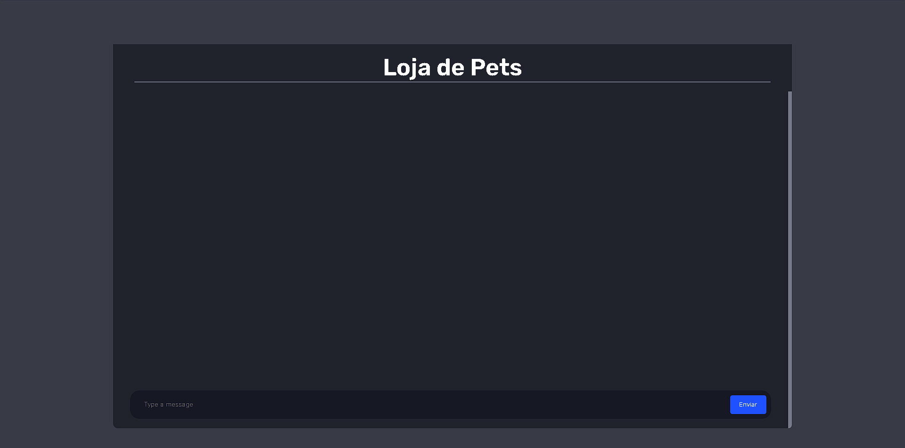
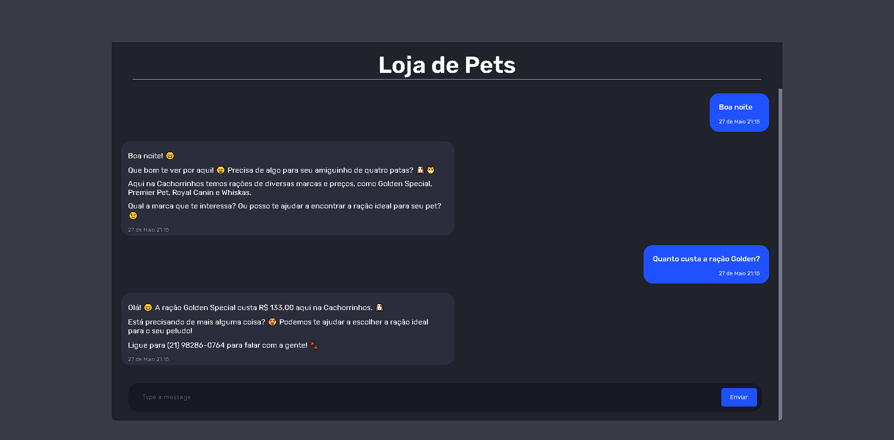

## ChatBot para loja de produtos para animais

<h3>⭐ ChatBot implementado com I.A Gemini da Google</h3>

<ul><li>Status: Concluído ✅</li></ul>

<h3>📃 Descrição do Projeto</h3>

<ul>
  <li>Projeto com intuito de implementar uma inteligencia artificial personalizada para prestar serviços como assistente virtual de Ecommerce</li>
  <li>I.A implementada com prompt personalizado podendo ser alterado para qualquer tipo de objetivo</li>
</ul>

<h3>📚 Tecnologias utilizadas</h3>
<ul>
  <li>
     <strong>Typescript</strong>
  </li>
  <li>
     <strong>React</strong>
  </li>
  <li>
     <strong>ViteJS</strong>
  </li>
  <li>
     <strong>NodeJS</strong>
  </li>
</ul>

<h3>📷 Imagens do projeto</h3>

